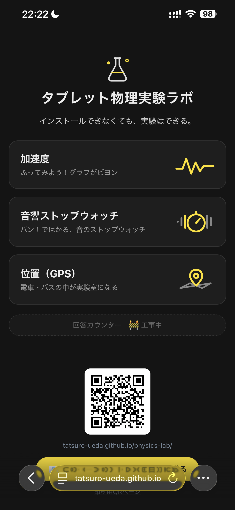
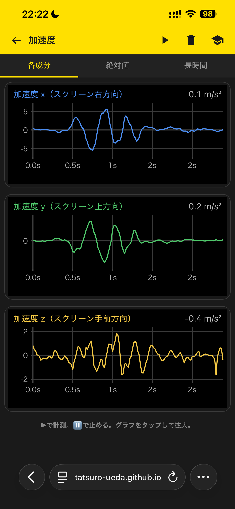
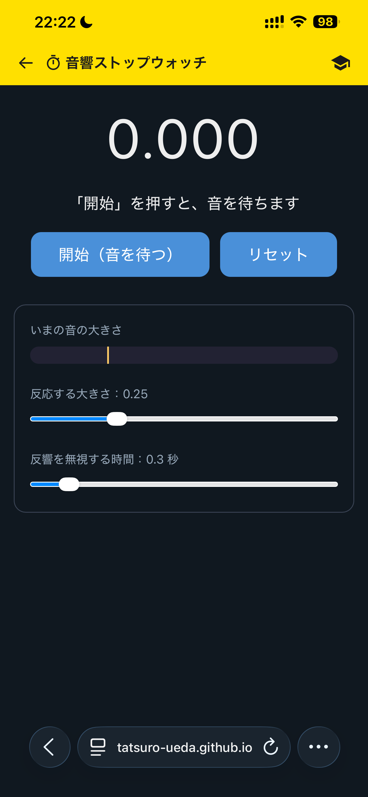

# タブレット物理実験ラボ（physics-lab）

> **インストールできなくても、実験はできる。**

学校端末（iPad / Chromebook）の**ブラウザだけ**で動く、物理計測アプリ集です。
GIGA端末に元から入っているセンサー（加速度・ジャイロ・磁気・GPS・マイク）を使って、
生徒が「変位・速度・加速度」「音」「位置」を**自分の手で計測して観察する**ためにつくりました。

**無料 ・ インストール不要 ・ アカウント不要 ・ 外部通信なし（HTTPSでのみ動作）**

<p>
  
  
  
</p>

---

# 使う人向け（先生・生徒）

## 30秒でわかる

- **何ができる？** 端末のセンサーの値を、ブラウザでリアルタイムにグラフ表示・計測できます。
- **誰のため？** 中学・高校の理科授業。**先生が導入し、生徒が触って観察する**ことを想定しています。
- **どう始める？** 下のURLを開くか、QRコードを読むだけ。ダウンロードもログインも要りません。

## いますぐ試す

| 開き方 | |
|---|---|
| **URL** | https://tatsuro-ueda.github.io/physics-lab/ |
| **QRコード** |  |
| **印刷して配りたい** | [印刷用QRポスター](講習会印刷用_タブレット物理実験ラボQR.png)（教室掲示・配布用） |

> ⚠️ センサーとマイクは**HTTPS（安全な接続）でしか動きません**。
> 上記URLはHTTPSなのでそのまま動きます。ファイルを保存して `file://` で開くと計測はできません。

## アプリ一覧

| アプリ | 何を計る | ひとこと | 状態 |
|---|---|---|---|
| **加速度** | 加速度センサー（各成分 / 絶対値 / 長時間） | ふってみよう！グラフがビヨン | 本命 |
| **音響ストップウォッチ** | マイク（音の立ち上がりで計時） | パン！ではかる、音のストップウォッチ | 本命 |
| **位置（GPS）** | GPS（変位 / 速度 / 加速度） | 電車・バスの中が実験室になる | 本命 |
| ジャイロスコープ | 角速度（3軸） | | 対応 |
| 磁気センサー（3軸） | 磁束密度（3軸） | | 対応 |
| コンパス | 方位（磁気） | | 旧デザイン・メニュー非表示 |
| 音のスペクトル | マイク（周波数分析） | | 旧デザイン・メニュー非表示 |

## 授業での使い方（例：重力加速度 約9.8 を読む）

「加速度」アプリで、落下中の加速度が **約 9.8 m/s²** になることを生徒自身に読ませる流れです。

1. **加速度**を開き、`絶対値` タブを選ぶ
2. `▶` を押して、短い自由落下または水平投射を記録する
3. `⏸` を押して一時停止する
4. グラフを**タップして拡大**する
5. **ピンチ**で、落下区間が見やすい幅まで広げる
6. **ドラッグ**で、区間を見やすい位置へ寄せる
7. 点を**タップ**して、約 9.8 m/s² を読む

> 設計の狙いは「高機能」より **授業が止まらないこと**。開くまでが軽く、最初の成功までが短く、
> つまずいても生徒だけで回復でき、どのページも操作が似ている——を優先しています。

## 他ツールとの違い

| | このアプリ | PhET | phyphox | Vernier / PASCO |
|---|---|---|---|---|
| 計測 | **端末の実センサー** | シミュレーション | 実センサー | 専用器具 |
| 準備 | **URL/QRだけ** | URLだけ | アプリ導入 | 器具・予算 |
| 授業向けの軽さ | **説明を減らす設計** | 分かりやすい | 高機能ゆえ説明多め | 強力だが重い |

---

# つくる人向け（開発者）

改造・貢献したい人向けの情報です。ソースは公開しています：
https://github.com/tatsuro-ueda/physics-lab

## 動かす環境と2本のURL

外部ライブラリはすべて同梱し、実行時に外部ネットワークへ依存しません（学校ネット制限・長期保守のため）。
配信URLは役割の違う2本立てです。

| URL | 役割 |
|---|---|
| https://tatsuro-ueda.github.io/physics-lab/ | **学校用の本命**（GitHub Pages。main にpushすると自動更新） |
| https://physics-lab.exe.xyz/ | 開発・検証用（専用VMのCaddyが配信。即時反映） |

## リポジトリ構成と「部品対応表」

**方針：同じ形の部品は1か所にだけ置く（同型散在の禁止）。**
「この部品はどこを直せばいいか」は必ずこの表で引きます。

| 直したいもの | 触るファイル | 備考 |
|---|---|---|
| **グラフ描画**（時間軸圧縮・目盛り・自動スケール） | `src/lab-common.js` | 3軸ページ共通の正本 |
| **タップ操作**（線タップ=値 / 線外タップ=拡大） | `src/lab-common.js` | 同上 |
| **▶⏸ / 🗑 の挙動** | `src/lab-common.js` | 同上 |
| タップ値の桁数（有効数字3桁） | `src/lab-common.js` の `toPrecision(3)` | |
| ヘッダー現在値の桁数 | `src/` 各ページの `digits:` 設定 | 現在は全ページ小数1桁 |
| 加速度センサーとの接続・iOS符号補正 | `src/acceleration.html` の `<script>` | |
| ジャイロとの接続 | `src/gyroscope.html` の `<script>` | |
| 磁気センサーとの接続・非対応案内 | `src/magnetometer.html` の `<script>` | |
| **🔰チュートリアルの器**（進捗ドット・あと◯つ・完了/もっとやる・localStorage・🔰トグル・CSS） | `src/tutorial.js` | 加速度・音響SW共通の正本 |
| チュートリアルの**ステップ内容**（判定・文言・順序） | 各ページの `STEPS` / `MORE` 定義 | 加速度=`src/acceleration.html`、音響SW=`src/stopwatch.html` |
| メニュー（並び・説明文・テーマ色） | `src/index.html` | |
| GPS（変位/速度/加速度タブ） | `src/location.html` | ※まだ独自実装（下記「今後の整理」） |
| 音響ストップウォッチの計測ロジック | `src/stopwatch.html` の `<script>` | チュートリアルの器は tutorial.js |
| 音のスペクトル | `src/sound.html` | ※まだ独自実装（メニュー非表示） |
| コンパス | `src/compass.html` | ※まだ独自実装（メニュー非表示） |
| **📱 縦向きガード**（横向きにしたら全面カバーで案内） | `src/orientation-guard.js` | 全ページ共通の正本。発動＝横向き×タッチ端末 |

### 3軸センサーページのしくみ

`acceleration / gyroscope / magnetometer` の3ページは同じ形です。
各ページは `createXYZLab({unit, digits, padMin, noDataMsg, start})` を1回呼ぶだけで、
グラフも操作も `lab-common.js` が面倒を見ます。ページ側に残っているのは
「そのセンサーからどうデータを取るか（start関数）」だけです。

### 単一HTML化のしくみ（build.py）

**⚠️ リポジトリ直下の `*.html` は全ページ生成物。直接編集しない。**（2026-07-18に全9ページを src/ 経由へ統一）
編集するのは `src/` の方。編集したら `python3 build.py` を実行すると、
`src/` の共有JS（lab-common.js・tutorial.js・orientation-guard.js）を各ページに埋め込んだ
**単一HTML**が直下に生成されます（依存はPython標準のみ）。

※単一HTMLをローカル保存して `file://` で開くと、センサー・マイクは動きません（安全なコンテキスト=HTTPS必須。実機確認済み）。
このため⬇ダウンロードボタンは2026-07-18に撤去しました。

### 🔰チュートリアルのしくみ（共通エンジン）

チュートリアルの「器」（進捗ドット・あと◯つ・完了/もっとやる・localStorage・🔰トグル・見た目）は
`src/tutorial.js` の `createTutorial({...})` が全部持ちます。各ページは `STEPS`（順序固定）と
`MORE`（もっとやる用）のステップ定義を渡し、入力を `tut.tick(e)`（動き駆動＝加速度）または
`tut.event(name,data)`（イベント駆動＝音響SW）で与えるだけ。器を直すときは tutorial.js の1ファイル。

## 開発・同期・デプロイ（毎回同じ操作）

**🚫 scpでの同期は使わない（2026-07-18に廃止）。**
理由：scpは履歴が残らず、送り先の未コミット変更を**黙って上書きして消す**。
実際にVMで作業中のファイルを消しかけました。同期は必ずgit経由（合流点はGitHub main）。
scpを使ってよいのは「repo管理外のファイルを1回だけ送る」場合のみ。

Mac・VMどちらで編集しても、git と build の手順は同じ。Caddy 配信だけは VM で行います。

### 初回だけ必要な設定（VM）

```bash
sudo ./scripts/install-deploy-helper.sh
```

これで `/usr/local/bin/physics-lab-publish` と最小 sudoers が入ります。
以後は `sudo cp ...` を打たずに、通常ユーザーのまま配信できます。

### 普段の手順

```bash
# 0) 編集を始める前に、必ず最新を取り込む
git pull origin main

# 1) src/ を編集したら必ずビルド（単一HTMLを再生成）
python3 build.py

# 2) commit して GitHub へ push（= GitHub Pages が自動更新）
git add -A && git commit -m "..."
git push origin master:main    # VMから（ローカルブランチ名がmasterのため）
git push                       # Macから（クローンがmain追跡ならこれだけ）

# 3) 検証環境へ配置（VM上。build + Caddy反映をまとめて実行）
./scripts/deploy-physics-lab
```

⚠️ 並行作業の約束：pullの前に手元の未コミット変更をcommitする。
編集の途中でも「とりあえずcommit」してよい（完璧より完了）。

## 設計上の約束

- 実行時に外部ネットワークへ依存しない。必要なライブラリ（uPlot・driver.js）は `src/` に同梱し、`build.py` で単一HTMLへ埋め込む。理由：学校ネット制限・長期保守
- テーマ色は黄色 `#ffe000`、軸色は X=`#4C8DF0`（青）/ Y=`#4FC96B`（緑）/ Z=`#F2C744`（黄）
- 軸ラベルには「正の向き」まで書く（例：アプリでは東を正）
- iOS Safariは加速度の符号がW3C仕様と逆 → `IOS_SIGN` で補正（phyphox-iOSの `kG=-9.81` と同じ考え方）

## 今後の整理（同型散在の残り）

- `location.html` の drawGraph は lab-common.js とほぼ同型 → 系列型（t/v分離）対応を共通側に入れて統合する
- `sound.html` / `compass.html` は旧デザインの独自実装（メニュー非表示）→ 使う判断が固まったら共通様式へ

## リポジトリの場所

- 合流点（正本）：GitHub `github.com/tatsuro-ueda/physics-lab` の `main`（public、Pages有効）
- VM：`exedev@physics-lab.exe.xyz` の `~/physics-lab`（専用VM。ローカルブランチは `main`）
- Mac作業コピー：`~/work/physics-lab/`（編集はここでもVMでもよい。同期はgitのみ）

## より詳しい設計ドキュメント

`docs/` 配下に、想定ユーザー・ジャーニー・アーキテクチャなどの設計資料があります。

- `docs/customer-journey.md` — 教員が採用を決めるまでの旅程
- `docs/user-journey.md` / `docs/user-job.md` — 生徒側の体験・ジョブ
- `docs/architecture.md` — アーキテクチャ
- `docs/repository-structure.md` — リポジトリ構造の定義
- `docs/coding-rules.md` / `docs/UX-policy.md` — コーディング / UXの方針
