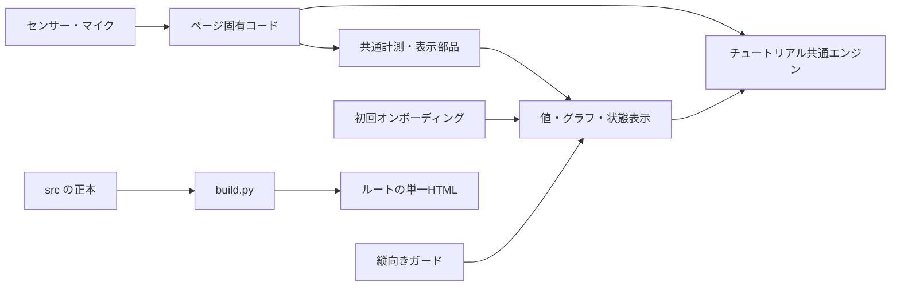

# アーキテクチャ設計

## 目的

タブレット物理実験ラボを、学校端末で安定して使え、ページが増えても同じ部品を重複実装しない構造に保つ。本書はシステムの責務分担、実装、ビルド、検証の正本である。

利用者向けの体験原則は [UX-policy.md](UX-policy.md)、ファイルの配置と編集可否は [repository-structure.md](repository-structure.md) を参照する。

## 設計原則

1. 同じ形の部品は一か所だけを正本にする。
2. ページ固有コードは、計測対象に固有の入力・変換・課題だけを持つ。
3. 実行時に外部ネットワークへ依存しない。
4. `src/` の正本から、配布用の単一HTMLを再現可能に生成する。
5. 画面上の成功とチュートリアルの合格判定を同じ状態へ接続する。
6. センサーとマイクは必要な間だけ確保し、画面を離れたら解放する。

## システム構成

## 責務分担

### ページ固有コード

各 `src/*.html` は次だけを担当する。

- ページの意味に固有のHTMLと表示モード
- センサーまたはマイクの許可取得
- 入力イベントの購読と物理量への変換
- OS差の補正
- チュートリアルの `STEPS` と `MORE`
- オンボーディングで指す要素と短い説明
- ページ固有のエラー文

共通部品が持つ描画、進捗、保存、共通操作をページ内へコピーしない。

### 3軸計測共通部品

`src/lab-common.js` は加速度・ジャイロ・磁力計に共通する次の責務を持つ。

- 時刻と計測値の保持
- uPlotによるグラフ描画と自動スケール
- タップ、拡大・縮小、パン、ピンチ
- 線タップによる値の表示
- 開始・一時停止・データ削除
- 表示モード切り替え
- チュートリアルへ公開する `isRunning`、`isZoomed`、`hasMarker`
- タブ離脱時に利用する `release`

チュートリアルが利用する状態は仮値で返さない。たとえば値の吹き出しを表示した時点で `hasMarker` も真にする。

### 体験チュートリアル

`src/tutorial.js` は次を担当する。

- パネルDOMとCSS
- 進捗ドットと残り件数
- ステップの読み込みとクリア演出
- `localStorage` による進捗保存
- 完了、最初から、もっとやる、閉じる
- 予想、観察、失敗時メッセージ
- 共通SVGアイコン `TUT_ICONS`

ページは `createTutorial()` を一度呼び、動き駆動なら `tick(e)`、状態遷移なら `event(name, data)` を渡す。

### 初回オンボーディング

`src/tour.js` はdriver.jsを包み、初回判定、テーマ、進捗、終了処理を担当する。ページは `createOnboardingTour()` にページ固有のキーとステップだけを渡す。`src/driver.js` と `src/driver.css` はベンダー資産として無改変で保持する。

### 縦向きガード

`src/orientation-guard.js` は、横向きかつタッチ端末で全面案内を表示する。各ページはスクリプトを読み込むだけとし、判定やCSSを複製しない。

## 入力から表示までの流れ

### センサー型ページ

1. 利用者の開始操作を受ける。
2. 必要ならOSのセンサー許可を求める。
3. ページ固有コードが入力値を取得し、符号・単位を補正する。
4. `lab.push()` が値を保存して表示を更新する。
5. 同じ入力を `tut.tick(e)` に渡し、現在の課題を判定する。
6. UI操作による状態変化は `lab.isRunning()` などを通じてチュートリアルへ伝える。

### イベント型ページ

1. 利用者の開始操作を受ける。
2. マイク許可を取得し、入力レベルを監視する。
3. ページ固有の状態機械が `idle / armed / running / paused` を遷移する。
4. 表示と履歴を更新する。
5. `tut.event()` に同じ状態遷移を通知する。

表示だけ更新してチュートリアルへ通知しない実装は禁止する。

## 端末資源のライフサイクル

- 権限要求は利用者のクリックまたはタップを起点にする。
- `visibilitychange` でページが隠れたら、計測を停止する。
- センサーイベントリスナーを解除する。
- MediaStreamの全トラックを停止する。
- AudioContextを閉じる。
- 復帰時に計測を自動再開しない。
- イベントループとリスナーを二重起動しない。
- リセットは計測値とページ内の一時状態を消すが、チュートリアル進捗は消さない。

## 端末差の吸収

- iOS Safariの加速度符号差はページ固有の入力境界で補正する。
- 許可APIの有無を機能検出し、ユーザーエージェントだけへ依存しない。
- iPad、Chromebook、PCの入力方法の違いをPointer EventsとCSS media queryで吸収する。
- 非対応端末や拒否された権限は例外として放置せず、ページ内に日本語で表示する。

## 実行時依存

学校ネットワークでCDNが遮断されても動作するよう、実行時に外部ネットワークへ依存しない。uPlot、driver.jsなど必要なライブラリは `src/` に同梱し、配布HTMLへ埋め込む。ベンダー資産は無改変で保持し、テーマや用途固有の調整は共通ラッパー側で行う。

## ビルド

- 編集対象は `src/` とする。
- `python3 build.py` は `src/*.html` が参照するローカルJS・CSSをインライン化する。
- 出力先はリポジトリ直下の同名HTMLとする。
- ルートHTMLは生成物であり、直接編集しない。
- ビルドはPython標準ライブラリだけで実行可能にする。
- `src/` の変更後は必ずビルドし、生成物もコミットする。
- センサーとマイクの配布・実機検証はHTTPSを使い、`file://` を前提にしない。

## 状態と保存

- オンボーディングの既読状態とチュートリアル進捗は、ページごとに一意な `localStorage` キーを使う。
- 保存に失敗しても計測本体を停止させない。
- 計測データはページのリセット対象、学習進捗は保持対象として分ける。
- ページを離れた後にセンサーやマイクの取得状態を残さない。

## 検証規約

変更の種類に応じて、次を確認する。

1. `git diff --check` で形式上の問題がない。
2. `python3 -m unittest discover -s tests -v` が成功する。
3. `python3 build.py` が全ページを生成できる。
4. ビルド後、意図しない生成物差分がない。
5. 共通部品の変更は、利用する全ページへ反映されている。
6. チュートリアルの合格条件は、画面上の成功操作で実際に成立する。
7. センサー・マイク・権限を伴う変更は、対象となる実機とHTTPSで確認する。
8. 初回ツアーはlocalStorageを消した状態と既読状態の両方で確認する。

不具合修正では、原因を再現するテストを先に追加する。自動化が困難な端末機能は、再現手順と期待結果を明記して手動確認する。

## 変更判断

- 複数ページで同じ変更が必要なら、先に共通部品へ置けないか検討する。
- 共通部品へ新しい責務を加えるときは、既存利用者を壊さないAPI境界を定める。
- ページ固有の物理的意味を共通部品へ押し込まない。
- ルートHTMLだけに存在する修正を作らない。
- 同期と合流はGitHubの `main` を通し、作業コピー間を`scp`で上書きしない。
